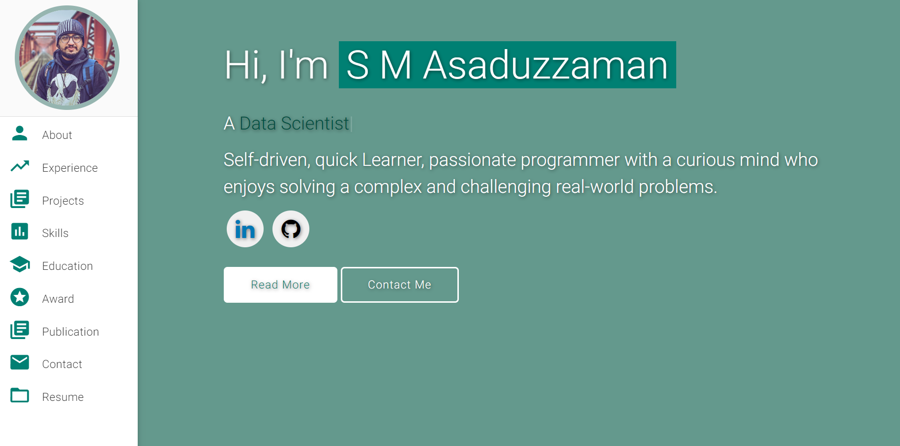

# Personal Portfolio ⚡️ 
> A clean, beautiful, responsive portfolio template for Software Developers!

[](https://smasaduzzaman.github.io/)
[](http://badges.mit-license.org)

### Website Preview
<p align="center"> 
  <kbd>
    <a href="https://smasaduzzaman.github.io/" target="_blank">
  </a>
  </kbd>
</p>

:star: Star me on GitHub — it helps!

## Features 📋
⚡️ Fully Responsive\
⚡️ Valid HTML5 & CSS3\
⚡️ Typing animation using `Typed.js`\
⚡️ Dark/Night Mode Toggle\
⚡️ Easy to modify\
⚡️ Working Contact Form with EmailJS


## Sections 📚
✔️ About me\
✔️ Experience\
✔️ Projects \
✔️ Skills \
✔️ Education\
✔️ Award\
✔️ Publication\
✔️ Contact Info\
✔️ Resume

To view a live example, **[click here](https://smasaduzzaman.github.io/)**

## Tools Used 🛠️
* [<b>GitHub Pages</b>](https://create-react-app.dev/docs/deployment/#github-pages) - To host my static website (HTML, CSS, JS).
* [<b>Materialize</b>](https://materializecss.com/) - A CSS framework to get Google's Material Design components.
* [<b>Typed.js</b>](https://mattboldt.com/demos/typed-js/) - JavaScript Library

## Contributing 💡
#### Step 1

- **Option 1**
    - 🍴 Fork this repo!

- **Option 2**
    - 👯 Clone this repo to your local machine.


#### Step 2

- **Build your code** 🔨🔨🔨

#### Step 3

- 🔃 Create a new pull request.

# 📝 Content Update Guide

This guide shows you how to easily update your portfolio content without touching the HTML/CSS/JS code directly.

## 🎯 **Quick Start**

All your content is stored in **`assets/js/data.js`** - just edit this file to update your portfolio!

## 📊 **What You Can Update**

### 1. **Personal Information**
```javascript
personal: {
    name: "Your Name",
    title: "Your Title",
    email: "your.email@gmail.com",
    phone: "+1234567890",
    location: "Your City, Country",
    profileImage: "assets/img/your-photo.jpg",
    resumeUrl: "assets/your-resume.pdf",
    description: "Your hero section description..."
}
```

### 2. **Social Links**
```javascript
social: {
    github: "https://github.com/yourusername/",
    linkedin: "https://www.linkedin.com/in/yourusername/",
    googleScholar: "https://scholar.google.com/citations?user=...",
    email: "mailto:your.email@gmail.com"
}
```

### 3. **Typing Animation Text**
```javascript
typingTitles: [
    'Data Scientist',
    'Your Title 1',
    'Your Title 2',
    'Add More Titles'
]
```

### 4. **About Section Stats**
```javascript
stats: [
    { count: 50, label: "Projects Completed" },
    { count: 5, label: "Research Papers" },
    { count: 5, label: "Years Experience" },
    { count: 15, label: "Technologies" }
]
```

## 💼 **Adding Experience**

Add new jobs to the `experience` array:

```javascript
{
    period: "Jan 2023 - Present",
    title: "Your Job Title",
    company: "Company Name",
    responsibilities: [
        "Responsibility 1",
        "Responsibility 2",
        "Responsibility 3"
    ],
    skills: ["Skill1", "Skill2", "Skill3"]
}
```

## 🚀 **Adding Projects**

Add new projects to the `projects` array:

```javascript
{
    title: "Project Name",
    description: "Brief project description...",
    image: "assets/img/project-image.jpg",
    technologies: ["Tech1", "Tech2", "Tech3"],
    category: ["ml", "web", "research"], // Choose from: ml, web, research
    links: {
        demo: "https://your-demo-link.com",  // Optional
        github: "https://github.com/you/repo"  // Optional
    }
}
```

### **Project Categories:**
- `"ml"` - Machine Learning projects
- `"web"` - Web applications
- `"research"` - Research projects

## 🛠 **Adding Skills**

Add skills to existing categories or create new ones:

```javascript
"Your Skill Category": [
    { 
        name: "Skill Name", 
        icon: "fas fa-icon-name",  // FontAwesome icon
        level: 85  // Percentage (0-100)
    }
]
```

### **Common Icons:**
- Programming: `fab fa-python`, `fab fa-js-square`, `fab fa-react`
- Tools: `fas fa-database`, `fas fa-chart-line`, `fab fa-docker`
- General: `fas fa-code`, `fas fa-brain`, `fas fa-tools`

## 📚 **Adding Publications**

Add new publications to the `publications` array:

```javascript
{
    title: "Your Paper Title",
    journal: "Journal Name, Year",
    authors: "Author1, Author2, Your Name, etc.",
    tags: ["Tag1", "Tag2", "Tag3"]
}
```

## 🖼 **Adding Images**

1. **Profile Photo**: Add to `assets/img/` and update `profileImage` in data.js
2. **Project Images**: Add to `assets/img/` and reference in project `image` field
3. **Resume**: Add PDF to `assets/` and update `resumeUrl` in data.js

## 🎨 **Customizing Colors & Styles**

To change colors, edit the CSS variables in `assets/css/style.css`:

```css
:root {
    --primary-color: #3b82f6;     /* Main blue color */
    --secondary-color: #f59e0b;   /* Orange accent */
    --text-primary: #1f2937;      /* Dark text */
    --bg-primary: #ffffff;        /* Background */
}
```

## 📱 **Testing Your Changes**

1. Save your changes to `data.js`
2. Refresh your browser
3. The content will automatically update!

## ⚠ **Important Notes**

- **Always backup** your `data.js` file before making changes
- **Use proper JSON syntax** - don't forget commas and quotes
- **Test locally** before deploying to GitHub Pages
- **Image paths** are relative to the main directory

## 🔧 **Common Issues**

### **Content Not Updating?**
1. Check browser console for JavaScript errors
2. Make sure `data.js` syntax is correct
3. Hard refresh the page (Ctrl+F5)

### **Images Not Loading?**
1. Check image file paths are correct
2. Make sure images exist in the `assets/img/` folder
3. Use forward slashes `/` in paths

### **Broken Layout?**
1. Check for missing commas in arrays
2. Ensure all quotes are properly closed
3. Validate JSON syntax

## 🚀 **Deployment**

After updating `data.js`:
1. Commit changes to Git
2. Push to GitHub
3. GitHub Pages will automatically deploy your updates!

---

## 📞 **Need Help?**

If you run into issues:
1. Check the browser console for error messages
2. Validate your JSON syntax online
3. Compare your changes with the original structure
4. Feel free to reach out for assistance!

---

# 🌙 **Dark Mode Feature**

Your portfolio includes a beautiful dark/night mode toggle that provides a better viewing experience in low-light conditions.

## 🎯 **How It Works**

- **Toggle Button**: Moon/Sun icon in the top navigation
- **Auto-Save**: Remembers your preference in browser storage
- **System Detection**: Automatically detects your OS theme preference
- **Smooth Transitions**: All elements transition smoothly between themes
- **Accessibility**: Proper ARIA labels and keyboard navigation

## 🎨 **Dark Mode Features**

- **Optimized Colors**: Carefully chosen dark theme colors for better readability
- **Reduced Eye Strain**: Perfect for late-night coding or browsing
- **Consistent Design**: All components adapt seamlessly to dark theme
- **Professional Look**: Sleek dark interface maintains professional appearance

## 🔧 **Customizing Dark Mode Colors**

To customize dark mode colors, edit the CSS variables in `assets/css/style.css`:

```css
[data-theme="dark"] {
    --primary-color: #60a5fa;      /* Light blue for dark mode */
    --text-primary: #f9fafb;       /* Light text */
    --bg-primary: #111827;         /* Dark background */
    --bg-secondary: #1f2937;       /* Secondary dark background */
    /* ... more variables */
}
```

## 💡 **How Users Can Use It**

1. **Manual Toggle**: Click the moon/sun icon in the navigation
2. **Automatic**: Will respect system theme preference if no manual selection
3. **Persistent**: Choice is saved and restored on next visit
4. **Responsive**: Works perfectly on all device sizes

---

# 📧 **Contact Form Email Setup**

Your portfolio includes a working contact form that can send real emails using EmailJS (free service).

## 🚀 **Setting Up Email Functionality**

### **Step 1: Create EmailJS Account**
1. Go to [https://www.emailjs.com/](https://www.emailjs.com/)
2. Sign up for a **free account** (200 emails/month)
3. Verify your email address

### **Step 2: Add Email Service**
1. In EmailJS dashboard, go to **"Email Services"**
2. Click **"Add New Service"**
3. Choose your email provider:
   - **Gmail** (recommended)
   - **Outlook**
   - **Yahoo**
   - Or any other supported service
4. Follow the setup instructions to connect your email
5. **Copy the Service ID** (e.g., `service_abc123`)

### **Step 3: Create Email Template**
1. Go to **"Email Templates"** in the dashboard
2. Click **"Create New Template"**
3. Use this template content:

```
Subject: New message from {{from_name}} - {{subject}}

From: {{from_name}}
Email: {{from_email}}
Subject: {{subject}}

Message:
{{message}}

---
Sent from your portfolio contact form
```

4. **Save the template** and copy the **Template ID** (e.g., `template_xyz789`)

### **Step 4: Get Public Key**
1. Go to **"Integration"** in the dashboard
2. Copy your **Public Key** (e.g., `abc123def456`)

### **Step 5: Update Configuration**
Edit `assets/js/emailConfig.js` and replace the placeholder values:

```javascript
const EMAIL_CONFIG = {
    publicKey: 'your_actual_public_key_here',
    serviceId: 'your_actual_service_id_here', 
    templateId: 'your_actual_template_id_here'
};
```

### **Step 6: Test Your Contact Form**
1. Open your portfolio website
2. Fill out the contact form completely
3. Click **"Send Message"**
4. You should receive an email in your inbox!

## 🎯 **What Happens When Form is Submitted**

- **Before Setup**: Shows "EmailJS not configured" error
- **After Setup**: 
  - Shows loading spinner
  - Sends real email to your inbox
  - Displays success message
  - Resets form automatically

## 🔧 **Troubleshooting**

### **Form Not Working?**
1. Check browser console (F12) for error messages
2. Verify all three values in `emailConfig.js` are correct
3. Make sure your email service is properly connected in EmailJS
4. Test with a simple message first

### **Not Receiving Emails?**
1. Check your spam/junk folder
2. Verify the email template is properly saved
3. Make sure your email service is active in EmailJS dashboard
4. Try sending a test email from EmailJS dashboard first

### **Console Errors?**
- `EMAIL_CONFIG is not defined`: Make sure `emailConfig.js` loads before `script.js`
- `emailjs is not defined`: Check if EmailJS CDN is loading properly
- `Service ID not found`: Double-check your service ID in EmailJS dashboard

## 💡 **Free Tier Limits**
- **200 emails per month** (perfect for portfolio contact forms)
- **No credit card required**
- **Reliable delivery**

## 🛡 **Security Notes**
- Public key is safe to expose (it's meant to be public)
- EmailJS handles all the secure email sending
- No server required - works with static hosting (GitHub Pages)

---

*Happy updating! 🎉*

## License 📄
This project is licensed under the MIT License - see the [LICENSE.md](./LICENSE) file for details.
